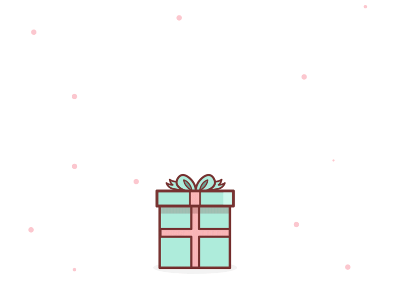
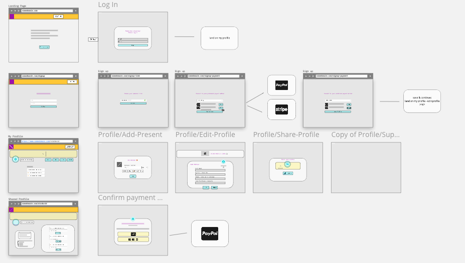

Gift Hub
==================

[Goals](#Project) | [Setup](#Setup) | [DB Connection](#DB) | [Programme](#Interact) | [Run Tests](#Tests) | [User Stories](#User-Stories) | [Wireframe](#Wireframe)

<div align="left"> 
   </a> 
   </a> 
<div>

Gift Hub is a platform allowing users to send & receive small gifts to friends.

A collaboration between [Suhani](https://github.com/suhani-zaman), [Hotu](https://github.com/ClaimingCookie5), [Blessing](https://github.com/BlessingUb), [Farya](https://github.com/Xfarya) & [Corinne](https://github.com/CorinneBosch) around the theme 'work & social'. We have set ourselves the ambitious challenge to pick up MERN stack within 14 days to make the best out of our remaining time at Makers.

Since graduating from Makers I integrated a few more features on this project individually.\
My implementations are integrated on `main`, but you can check out the original project on `only-gifts` branch.
  
## <a name="Project">Engineering Project III - Gift Hub</a>
Our final group project at Makers Academy, learning and implementing the following techniques

- Learn to MongoDB, Express, React, Node (MERN)
- Feature and Unit testing using Cypress & Jest
- Agile Methology for user stories & domain modeling
- Creating Tickets & using Trello
- Break down projects into tasks and allocate them to pairs
- Run stand-ups and retrospectives
- Use a branch/PR/merge git workflow
- Give and receive meaningful code review

## <a name="Setup">Setup</a>

1. **Fork** this [Gift-Hub repository](https://github.com/CorinneBosch/gift-hub/) 
2. Then clone **your** fork to your computer.
3. Ensure you have `node.js` and `npm` installed. Check node version with `node -v`
4. Install all node modules in both client & server directory with `npm i`.

## <a name="DB">Database connection</a>

To run the application you have to set up your own MongoDB database.\
Use the following [guide](https://docs.mongodb.com/manual/tutorial/getting-started/) to create an account.\
In the server directory create a `.env` file and add it to your `.gitignore`.\
Set your cluster connection string equal to `DB_URI` in your `.env` file.\
Follow the next step to establish a connection with your database.

## <a name="Interact">Interact with the programme</a>

Start the server side of your application in the terminal `cd server && npm start`\
You should be notified when the connection is establised successfully.
  
Then open the client side concurrently in a new terminal `cd client && npm start`\
Your browser should open up a new window and direct you to `http://localhost:3000`.

Now you can register on Gift Hub and share your custom link with your friends!

## <a name="Tests">Run test</a>

**Client Tests**\
To run integration tests open the cypress extension in your command line.\
In a seperate terminal start your client local host.
```
$ cd client && npx cypress open
$ cd client && npm start
```
Now choose the `Run integration specs` option to run all tests or select individual tests.
  
You can also execute all tests in your terminal.\
Start local host first and run cypress in a second terminal.
```
$ cd client && npm start
$ cd client && npx cypress run
```
<br />
  
**Server Tests**\
The server side uses Jest for end-point testing.\
Test data is stored in a seperate database table.\
Create a seperate database in your cluster.\
Set it equal to `DB_URI_TEST` in your `.env` file.
```
$ cd server && npm test
```


## <a name="User-Stories">User stories</a>

Based on the objectives and expectations of our app we came up with the following user stories:

```
As a user
So that I may receive a gift from my friend
I would like to create an account on TBC.

~ (- sign-up page ~ username, email, password - database setup - verification - profile page)

As a friend
So that I may show my appreciation
I would like to be send a small gift to my friend.

~ (- profile page link (access to page) - button to make a donation - receive a message thanking friend for gift)
```

## <a name="Wireframe">Wireframe</a>

<div align="left"> 
   </a> 
<div>
